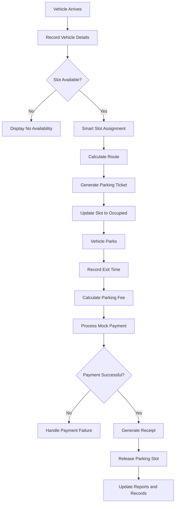
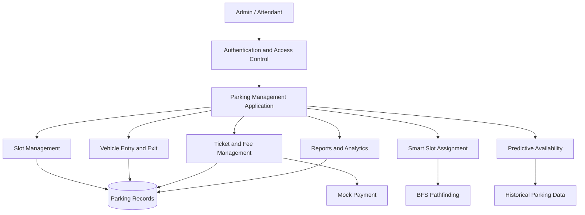

# 🚗 Vehicle Parking System

**A Smart, Software-Based Parking Management Solution**

A parking management application that simulates real-world parking operations, from vehicle entry and intelligent slot allocation to fee calculation, payment processing, and reporting. The system combines graph-based pathfinding and historical data analysis to improve parking slot assignment and estimate future slot availability.


---

## 📌 Table of Contents

- [Project Overview](#-project-overview)
- [Objectives](#-objectives)
- [Key Features](#-key-features)
- [System Workflow](#-system-workflow)
- [System Architecture](#-system-architecture)
- [Algorithms and Intelligence](#-algorithms-and-intelligence)
- [System Configuration](#-system-configuration)
- [User Roles](#-user-roles)
- [Reports and Analytics](#-reports-and-analytics)
- [Testing and Quality Assurance](#-testing-and-quality-assurance)
- [Documentation](#-documentation)
- [Future Enhancements](#-future-enhancements)
- [Team Members](#-team-members)

## 🚀 Project Overview

### Run the application

Python 3.10 or newer is required.

```bash
python -m venv .venv
source .venv/bin/activate  # Windows: .venv\Scripts\activate
pip install -r requirements.txt
python app.py
```

The application starts at `http://127.0.0.1:5000`. On first start it creates
`instance/parking.sqlite` and the initial SQLite schema. Set `SECRET_KEY` to a
private value before using the application outside local development.

Traditional parking management can involve manual slot assignment, inefficient space utilization, and limited visibility into parking occupancy. This project demonstrates how these operations can be managed through a centralized software application.

The system provides a simulated parking environment in which vehicles can enter and exit, receive parking slots, generate tickets, pay calculated fees, and release occupied slots. It also incorporates intelligent slot assignment and predictive availability estimation.

The application is designed to run locally without physical parking sensors, RFID readers, cameras, or payment terminals.

## 🎯 Objectives

- Automate the simulated vehicle entry and exit process.
- Maintain accurate parking slot occupancy information.
- Assign suitable parking slots using graph-based pathfinding.
- Calculate parking fees using configurable rates and grace periods.
- Simulate payment processing and receipt generation.
- Generate occupancy and revenue reports for operational monitoring.
- Estimate future slot availability using historical parking records.
- Implement role-based access control and audit logging.

## ✨ Key Features

### 🅿️ Parking Slot Management
- Maintains vacant and occupied slot states.
- Organizes parking spaces into a configurable grid.
- Supports different parking slot categories.
- Updates slot availability after vehicle entry and exit.

### 🚘 Vehicle Entry and Exit
- Records vehicle registration details.
- Captures entry and exit timestamps.
- Generates parking tickets for active parking sessions.
- Prevents the same slot from being assigned to multiple vehicles.
- Releases the allocated slot after successful exit processing.

### 🧠 Smart Slot Assignment
- Uses Breadth-First Search (BFS) for route exploration in the parking layout.
- Identifies suitable available slots according to the assignment rules.
- Determines a route through the simulated parking grid.
- Helps demonstrate how graph algorithms can support parking navigation.

### 💳 Fee Calculation and Payment
- Calculates parking charges from recorded parking duration.
- Supports configurable parking rates and grace periods.
- Simulates payment success and failure.
- Generates receipts for completed payment transactions.

### 📊 Reports and Analytics
- Summarizes total, occupied, and vacant parking slots.
- Generates occupancy and revenue reports.
- Supports exporting report data.
- Uses historical parking records as input for availability estimation.

### 🔮 Predictive Slot Availability
- Analyzes historical parking records.
- Estimates when occupied slots may become available.
- Helps demonstrate how historical usage patterns can support parking decisions.

*Prediction quality depends on the historical data and the estimation method implemented.*

### 🔐 Security and Access Control
- Provides separate Admin and Attendant roles.
- Restricts operations according to user permissions.
- Maintains audit logs for supported system activities.
- Supports validation and error handling for operational reliability.

## 🔄 System Workflow



## 🏗️ System Architecture

The system can be understood as a set of cooperating functional modules.



The diagram represents the logical organization of the system rather than a claim about a specific deployment architecture.

### Core Modules

| Module | Responsibility |
|---|---|
| Authentication | User login and role validation |
| Slot Management | Slot categories, occupancy, and availability |
| Vehicle Processing | Entry, exit, and vehicle records |
| Ticket Management | Ticket generation and parking session tracking |
| Fee Management | Duration-based parking charge calculation |
| Mock Payment | Simulated payment processing and receipts |
| Smart Assignment | Slot selection and BFS-based route exploration |
| Prediction | Historical-data-based availability estimation |
| Reporting | Occupancy, revenue, and exported reports |

## 🧮 Algorithms and Intelligence

### 1. Breadth-First Search (BFS)

BFS explores a graph level by level and can find a shortest path in an unweighted graph.

In this project, the parking layout is represented as a grid or graph. BFS explores reachable locations to determine a route to a suitable parking slot.

**Example:** If a vehicle enters at the parking entrance, the system can explore connected locations and determine a route to an available slot, provided the layout and movement rules are represented in the graph.

### 2. Predictive Availability

The prediction module uses historical parking records to estimate when an occupied slot may become available.

Potential inputs include:

- Previous parking durations
- Entry and exit timestamps
- Slot usage history
- Historical availability patterns

The estimates are intended to support planning rather than guarantee the exact departure time of a vehicle.

## ⚙️ System Configuration

The current demonstration setup includes:

| Parameter | Configuration |
|---|---|
| Parking capacity | 20 slots |
| Layout | 4 × 5 grid |
| Historical dataset | 200+ synthetic parking records |
| User roles | Admin and Attendant |
| Payment processing | Simulated |
| Hardware requirements | No physical parking hardware |
| Deployment | Local environment |

These values describe the configured demonstration environment and can be adjusted as the implementation evolves.

## 👥 User Roles

### Admin
- Accesses authorized management functions.
- Manages parking configuration and slot information.
- Reviews reports and system activity.
- Uses administrative features according to configured permissions.

### Attendant
- Processes vehicle entry and exit.
- Assists with parking slot allocation.
- Handles ticket and payment workflows where permitted.
- Views operational information available to the role.

Actual permissions depend on the implemented access-control rules.

## 📈 Reports and Analytics

The reporting module provides information to understand parking facility usage.

**Occupancy reporting**
- Total parking capacity
- Occupied slots
- Vacant slots
- Occupancy percentage

**Revenue reporting**
- Recorded parking transactions
- Parking fee totals
- Revenue summaries for the available reporting period

**Data export**

Supported reports can be exported for further analysis, depending on the implemented export functionality.

## 🧪 Testing and Quality Assurance

Testing is organized around the system requirements and operational workflows.

| Testing Area | Example Validation |
|---|---|
| Authentication | Valid and invalid login attempts |
| Access control | Unauthorized operations are rejected |
| Slot management | Occupancy changes correctly after allocation and release |
| Entry and exit | Vehicle details and timestamps are recorded |
| Fee calculation | Duration, rate, and grace-period rules are applied |
| Mock payment | Success and failure cases are handled |
| Pathfinding | BFS produces a valid route in the configured graph |
| Prediction | Availability estimates use the available historical records |
| Reporting | Occupancy and revenue summaries are consistent |
| Reliability | Invalid inputs and operational errors are handled |

The **Test Plan v1.0 contains 18 test cases** with requirements traceability.

Testing outcomes should be documented against the actual execution results; the table above describes validation objectives rather than claiming that every test has passed.

## 📚 Project Documentation

| Document | Purpose |
|---|---|
| **SRS v1.1** | Functional requirements, non-functional requirements, and system specifications |
| **Test Plan v1.0** | Test strategy, test cases, and Requirements Traceability Matrix (RTM) |
| **Architecture & Design Specification** | System architecture, UML diagrams, API design, and error handling |

## 🔮 Future Enhancements

- **Hardware Integration:** Connect LPR cameras, RFID readers, and occupancy sensors.
- **Real Payments:** Integrate a secure payment gateway.
- **Advanced Prediction:** Evaluate machine-learning models for parking duration and availability forecasting.
- **Mobile Application:** Support mobile-based parking discovery and ticket access.
- **Multi-Facility Support:** Manage multiple parking locations from a centralized interface.
- **Cloud Deployment:** Enable remote access, centralized monitoring, and scalable deployment.
- **Live Dashboard:** Display parking occupancy and operational metrics with automatic updates.

## 👨‍💻 Team Members

| Name | University ID |
|---|---|
| Ananya V | PES1UG24CS061 |
| Amogh Sharma | PES1UG24CS053 |
| Nagaraja Gari Ram Sai Govind | PES1UG24CS912 |

## 📌 Project Status

**Currently in development.**

The project demonstrates a software-based approach to parking management by combining workflow automation, graph-based pathfinding, historical-data analysis, access control, and reporting.

The implementation and documentation may evolve as features are refined and tested.

---

*Vehicle Parking System — Software Engineering Mini-Project*
